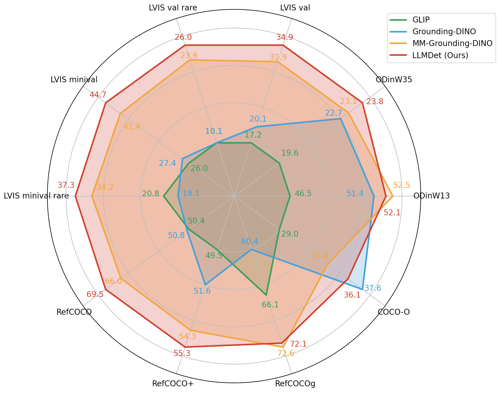

## LLMDet: Learning Strong Open-Vocabulary Object Detectors under the Supervision of Large Language Models

This is the official PyTorch implementation of [LLMDet](https://arxiv.org/abs/2501.18954).

🎉🎉🎉 Our paper is accepted by CVPR 2025 as a highlight paper✨, congratulations and many thanks to the co-authors!

If you find our work helpful, please kindly give us a star🌟

### Updates

- **[2025.06.06]** 🔥🔥🔥 Added [Gradio demo](https://huggingface.co/spaces/mrdbourke/LLMDet-demo) to Hugging Face, you can now try out LLMDet in your browser. (Thanks to [Daniel Bourke](https://github.com/mrdbourke) for valuable contributions)
- **[2025.04.07]** Update demo in huggingface. Release huggingface checkpoints.
- **[2025.04.04]** Our paper was selected as a highlight paper in CVPR2025.
- **[2025.03.25]** Update demo in mmdet.
- **[2025.02.27]** Our paper was accepted by CVPR2025.
- **[2025.01.31]** Release the code and paper.

### 1 Introduction



Recent open-vocabulary detectors achieve promising performance with abundant region-level annotated data. In this work, we show that an open-vocabulary detector co-training with a large language model by generating image-level detailed captions for each image can further improve performance. To achieve the goal, we first collect a dataset, GroundingCap-1M, wherein each image is accompanied by associated grounding labels and an image-level detailed caption. With this dataset, we finetune an open-vocabulary detector with training objectives including a standard grounding loss and a caption generation loss. We take advantage of a large language model to generate both region-level short captions for each region of interest and image-level long captions for the whole image. Under the supervision of the large language model, the resulting detector, LLMDet, outperforms the baseline by a clear margin, enjoying superior open-vocabulary ability. Further, we show that the improved LLMDet can in turn build a stronger large multi-modal model, achieving mutual benefits.

### 2 Model Zoo

| Model                         | AP<sup>mini</sup> | AP<sub>r</sub> | AP<sub>c</sub> | AP<sub>f</sub> | AP<sup>val</sup> | AP<sub>r</sub> | AP<sub>c</sub> | AP<sub>f</sub> |
| ----------------------------- | ----------------- | -------------- | -------------- | -------------- | ---------------- | -------------- | -------------- | -------------- |
| LLMDet Swin-T only p5         | 44.5              | 38.6           | 39.3           | 50.3           | 34.6             | 25.5           | 29.9           | 43.8           |
| LLMDet Swin-T                 | 44.7              | 37.3           | 39.5           | 50.7           | 34.9             | 26.0           | 30.1           | 44.3           |
| LLMDet Swin-B                 | 48.3              | 40.8           | 43.1           | 54.3           | 38.5             | 28.2           | 34.3           | 47.8           |
| LLMDet Swin-L                 | 51.1              | 45.1           | 46.1           | 56.6           | 42.0             | 31.6           | 38.8           | 50.2           |
| LLMDet Swin-L (chunk size 80) | 52.4              | 44.3           | 48.8           | 57.1           | 43.2             | 32.8           | 40.5           | 50.8           |

**NOTE:**

1. AP<sup>mini</sup>: evaluated on LVIS `minival`.
2. AP<sup>val</sup>: evaluated on LVIS `val 1.0`.
3. AP is fixed AP.
4. All the checkpoints and logs can be found in [huggingface](https://huggingface.co/fushh7/LLMDet) and [modelscope](https://modelscope.cn/models/fushh7/LLMDet).
5. Other benchmarks are tested using `LLMDet Swin-T only p5`.

### 3 Our Experiment Environment

Note: other environments may also work.

- pytorch==2.2.1+cu121
- transformers==4.37.2
- numpy==1.22.2 (numpy should be lower than 1.24, recommend for numpy==1.23 or 1.22)
- mmcv==2.2.0, mmengine==0.10.5
- timm, deepspeed, pycocotools, lvis, jsonlines, fairscale, nltk, peft, wandb

### 4 Data Preparation

```
｜--huggingface
｜  |--bert-base-uncased
｜  |--siglip-so400m-patch14-384
｜  |--my_llava-onevision-qwen2-0.5b-ov-2
｜  |--mm_grounding_dino
｜  |  |--grounding_dino_swin-t_pretrain_obj365_goldg_grit9m_v3det_20231204_095047-b448804b.pth
｜  |  |--grounding_dino_swin-b_pretrain_obj365_goldg_v3de-f83eef00.pth
｜  |  |--grounding_dino_swin-l_pretrain_obj365_goldg-34dcdc53.pth
｜--grounding_data
｜  |--coco
｜  |  |--annotations
｜  |  |  |--instances_train2017_vg_merged6.jsonl
｜  |  |  |--instances_val2017.json
｜  |  |  |--lvis_v1_minival_inserted_image_name.json
｜  |  |  |--lvis_od_val.json
｜  |  |--train2017
｜  |  |--val2017
｜  |--flickr30k_entities
｜  |  |--flickr_train_vg7.jsonl
｜  |  |--flickr30k_images
｜  |--gqa
｜  |  |--gqa_train_vg7.jsonl
｜  |  |--images
｜  |--llava_cap
｜  |  |--LLaVA-ReCap-558K_tag_box_vg7.jsonl
｜  |  |--images
｜  |--v3det
｜  |  |--annotations
｜  |  |  |--v3det_2023_v1_train_vg7.jsonl
｜  |  |--images
｜--LLMDet (code)
```

- pretrained models
  - `bert-base-uncased`, `siglip-so400m-patch14-384` are directly downloaded from huggingface.
  - To fully reproduce our results, please download `my_llava-onevision-qwen2-0.5b-ov-2` from [huggingface](https://huggingface.co/fushh7/LLMDet) or [modelscope](https://modelscope.cn/models/fushh7/LLMDet), which is slightly fine-tuned by us in early exploration. We find that the original `llava-onevision-qwen2-0.5b-ov` is still OK to reproduce our results but users should pretrain the projector.
  - Since LLMDet is fine-tuned from`mm_grounding_dino`, please download their checkpoints [swin-t](https://download.openmmlab.com/mmdetection/v3.0/mm_grounding_dino/grounding_dino_swin-t_pretrain_obj365_goldg_grit9m_v3det/grounding_dino_swin-t_pretrain_obj365_goldg_grit9m_v3det_20231204_095047-b448804b.pth), [swin-b](https://download.openmmlab.com/mmdetection/v3.0/mm_grounding_dino/grounding_dino_swin-b_pretrain_obj365_goldg_v3det/grounding_dino_swin-b_pretrain_obj365_goldg_v3de-f83eef00.pth), [swin-l](https://download.openmmlab.com/mmdetection/v3.0/mm_grounding_dino/grounding_dino_swin-l_pretrain_obj365_goldg/grounding_dino_swin-l_pretrain_obj365_goldg-34dcdc53.pth) for training.
- grounding data (GroundingCap-1M)
  - `coco`: You can download it from the [COCO](https://cocodataset.org/) official website or from [opendatalab](https://opendatalab.com/OpenDataLab/COCO_2017).
  - `lvis`: LVIS shares the same images with COCO. You can download the minival annotation file from [here](https://huggingface.co/GLIPModel/GLIP/blob/main/lvis_v1_minival_inserted_image_name.json), and the val 1.0 annotation file from [here](https://huggingface.co/GLIPModel/GLIP/blob/main/lvis_od_val.json). 
  - `flickr30k_entities`：[Flickr30k images](http://shannon.cs.illinois.edu/DenotationGraph/).
  - `gqa`： [GQA images](https://nlp.stanford.edu/data/gqa/images.zip).
  - `llava_cap`：[images](https://huggingface.co/datasets/liuhaotian/LLaVA-Pretrain/blob/main/images.zip) .
  - `v3det`：The V3Det dataset can be downloaded from [opendatalab](https://opendatalab.com/V3Det/V3Det). 
  - Our generated jsonls can be found in [huggingface](https://huggingface.co/fushh7/LLMDet) or [modelscope](https://modelscope.cn/models/fushh7/LLMDet).
  - For other evalation datasets, please refer to [MM-GDINO](https://github.com/open-mmlab/mmdetection/blob/main/configs/mm_grounding_dino/dataset_prepare.md).

### 5 Usage

#### 5.1 Training

```
bash dist_train.sh configs/grounding_dino_swin_t.py 8 --amp
```

#### 5.2 Evaluation

```
bash dist_test.sh configs/grounding_dino_swin_t.py tiny.pth 8
```

#### 5.3 Demo

```
import nltk
nltk.download('punkt')
nltk.download('averaged_perceptron_tagger')
nltk.download('punkt_tab')
nltk.download('averaged_perceptron_tagger_eng')
nltk.download('stopwords')
```

- For Phrase Grounding and Referential Expression Comprehension, users should first download `nltk` packages.
- If you do not want to load the llm during inference, please modify the config `lmm=None`.

1. Open-Vocabuary Object Detection (开放词汇目标检测)

```
python image_demo.py images/demo.jpeg \
  configs/grounding_dino_swin_t.py --weight tiny.pth \
  --text 'apple .' -c --pred-score-thr 0.4
```

<div align=center>

</div>

2. Phrase Grounding (短语定位)

```
python image_demo.py images/demo.jpeg \
  configs/grounding_dino_swin_t.py --weight tiny.pth \
  --text 'There are many apples here.' --pred-score-thr 0.35
```

<div align=center>

</div>

3. Referential Expression Comprehension (指代性表达式理解)

```
python image_demo.py images/demo.jpeg \
  configs/grounding_dino_swin_t.py --weight tiny.pth \
  --text 'red apple.' --tokens-positive -1 --pred-score-thr 0.4
```

<div align=center>

</div>

#### 5.4 Use LLMDet in Huggingface

- Please refer to [hf_readme](https://github.com/iSEE-Laboratory/LLMDet/tree/main/hf_model).

#### 5.5 Student Attention Pipeline (Phase 1, Frozen Detector)

This repository now includes an additive Phase-1 pipeline for classroom attention analysis on top of your trained detector checkpoints.

Design goal:

- keep the detection model frozen (avoid detection regression),
- add temporal behavior modeling as a separate stack,
- support HPC training (single GPU and multi-GPU DDP),
- keep privacy safeguards in inference visualization.

Phase-1 files:

- `attention/detector_adapter.py`: loads frozen LLMDet checkpoint and runs student detection.
- `attention/tracking.py`: online IoU tracker for stable `track_id` across frames.
- `attention/features.py`: per-student feature extraction (CLIP if available + robust fallback features).
- `attention/sequence_builder.py`: parses JSONL + filename timestamps, creates temporal samples.
- `attention/temporal_model.py`: Transformer attention classifier.
- `attention/train_temporal_ddp.py`: DDP/AMP temporal training script.
- `attention/realtime_infer.py`: real-time pipeline (detect -> track -> feature -> temporal prediction).
- `configs/attention_temporal.yaml`: attention pipeline config.
- wrappers:
  - `attention_build_sequences.py`
  - `attention_train.py`
  - `attention_realtime.py`
  - `dist_attention_train.sh`

Data expectation:

- annotation JSONL has image `filename` and `grounding.regions[].bbox`.
- sequence ordering is extracted from filename (`video_xxxx`, frame index, timestamp).
- image root points to the actual image folder (for student data usually `../grounding_data/stu_img/frames`).

Labeling strategy in Phase-1:

- weak labels are derived from region phrases/tags/caption text (for example: `focused`, `engaged`, `typing`, `sleeping`).
- per-track sample label is majority vote over frame-level weak labels.
- this enables training even before full dense temporal annotations are available.

Run order from `LLMDet/`:

1) Build train sequences:

```
python attention_build_sequences.py \
  --jsonl ../grounding_data/stu_img/student_behavior_emotion_vg7_train.jsonl \
  --image-root ../grounding_data/stu_img/frames \
  --output-dir ../grounding_data/stu_img/attention_sequences/train
```

2) Build val sequences:

```
python attention_build_sequences.py \
  --jsonl ../grounding_data/stu_img/student_behavior_emotion_vg7_val.jsonl \
  --image-root ../grounding_data/stu_img/frames \
  --output-dir ../grounding_data/stu_img/attention_sequences/val
```

3) Train temporal model (single GPU):

```
python attention_train.py --config configs/attention_temporal.yaml --launcher none
```

4) Train temporal model (DDP):

```
bash dist_attention_train.sh configs/attention_temporal.yaml 8
```

5) Real-time inference:

```
python attention_realtime.py --config configs/attention_temporal.yaml --source 0
```

For headless HPC/Jupyter sessions (no display server), run:

```
python attention_realtime.py --config configs/attention_temporal.yaml --source /path/to/video.mp4 --no-show --out-video work_dirs/attention_temporal/realtime_out.mp4
```

Key config defaults:

- detector config: `configs/grounding_dino_swin_t.py`
- frozen checkpoint: `work_dirs/grounding_dino_swin_t/iter_15000.pth`
- temporal classes: `attentive`, `distracted`, `sleeping`, `engaged`
- privacy: face-region blur disabled by default in current config (`privacy.anonymize_faces: false`)

Important troubleshooting notes:

1. `Built 0 temporal samples`

- most common cause is wrong `--image-root`.
- for student data with `frames/` subfolder, use:
  `--image-root ../grounding_data/stu_img/frames`.
- if needed, temporarily test with `--min-track-len 1` to validate data flow.

2. CLIP loading error related to `torch.load` security checks

- newer `transformers` can block `.bin` loading on older torch versions.
- Phase-1 extractor already fails open: CLIP is disabled automatically and fallback features are used.
- pipeline should continue instead of crashing.

3. TensorFlow oneDNN / cuDNN registration logs during sequence build

- these are environment-level warnings and are non-fatal for this pipeline.

4. OpenCV display crash in headless servers (`qt.qpa.xcb: could not connect to display`)

- run realtime inference with `--no-show`.
- if you still need visualization output, also pass `--out-video <path>.mp4`.
- GUI mode (`--show`) should be used only on machines with an active display.

5. Non-student objects receiving boxes/IDs in realtime output

- tune detector geometric filters in `configs/attention_temporal.yaml`:
  - `detector.min_rel_area`
  - `detector.max_rel_area`
  - `detector.min_aspect_ratio`
  - `detector.max_aspect_ratio`
  - `detector.nms_iou_thr`
- these filters remove many desk/object false positives while keeping person-like boxes.

6. Label flicker between frames

- increase temporal smoothing settings in `configs/attention_temporal.yaml`:
  - `inference.label_smooth_window`
  - `inference.label_switch_margin`
- `tracking.min_hits` can also reduce unstable short-lived IDs.

7. IDs switch frequently or non-student objects receive IDs

- tracker now uses IoU + appearance matching (`tracking.appearance_weight`, `tracking.min_match_score`) for stronger identity consistency.
- student filtering now combines confidence, geometry and NMS in detector adapter.
- tune these keys first:
  - `detector.score_thr`
  - `detector.min_rel_area`, `detector.max_rel_area`
  - `tracking.iou_match_thr`, `tracking.max_age`, `tracking.min_hits`

8. Model predicts mostly one class (for example always `attentive`)

- rebuild sequences and retrain after the latest updates:
  - expanded weak-label mapping,
  - unknown-label skipping in sequence generation,
  - class-weighted cross entropy in temporal training (`training.use_class_weights: true`).
- training now prints `class_hist` and `class_weights` at startup so imbalance is explicit.

9. Guarding invalid 4-class training runs

- training now supports hard class-coverage checks:
  - `training.enforce_full_class_coverage`
  - `training.required_min_per_class`
- if any class count is below the threshold, training raises an explicit error and stops.
- this prevents spending GPU hours on runs where one or more classes are missing.

10. Class-wise evaluation artifacts

- best-validation class metrics are exported to:
  - `work_dirs/attention_temporal/checkpoints/best_val_class_metrics.json`
- best-validation confusion matrix is exported to:
  - `work_dirs/attention_temporal/checkpoints/best_val_confusion_matrix.npy`
- TensorBoard now logs per-class precision/recall/F1 during validation.

What Phase-1 optimizes for:

- reliable end-to-end pipeline execution with your existing trained detector,
- minimal disruption to current detection training/inference code,
- fast iteration on temporal modeling before optional deeper detector-temporal co-training.

Implementation walkthrough across codebase:

1. Entry scripts

- `attention_build_sequences.py` calls `attention.sequence_builder.build_sequences(...)`.
- `attention_train.py` calls `attention.train_temporal_ddp.main()`.
- `attention_realtime.py` calls `attention.realtime_infer.main()`.

2. Frozen detection stage

- `attention/detector_adapter.py` loads the detector with existing MMDet APIs:
  - `mmdet.apis.inference.init_detector`
  - `mmdet.apis.inference.inference_detector`
- student prompt and score threshold are configurable in `configs/attention_temporal.yaml`.
- detector checkpoint is read-only/frozen (no detector weights updated in temporal training).

3. Tracking stage

- `attention/tracking.py` assigns and maintains `track_id` via IoU matching.
- output structure per frame is a list of tracked objects: `(track_id, bbox_xyxy, score)`.

4. Feature stage

- `attention/features.py` extracts one feature vector per tracked crop:
  - CLIP embedding (when available),
  - geometric bbox features,
  - color statistics features.
- if CLIP loading fails (for example torch/transformers security gating), code falls back automatically to non-CLIP features and continues.

5. Sequence-building stage (offline preprocessing)

- `attention/sequence_builder.py` parses JSONL lines and:
  - extracts `video_id`, `frame_idx`, `timestamp` from filename,
  - groups and sorts observations temporally,
  - performs track association,
  - converts each track to a temporal tensor `x` with shape `[T, D]`,
  - derives weak label `y` from phrases/tags/caption mapping.
- output is saved as compressed `.npz` files under:
  - `<output-dir>/sequences/*.npz`
- metadata summary is saved at:
  - `<output-dir>/meta.json`

6. Temporal model stage

- `attention/temporal_model.py` defines:
  - `AttentionTransformer` (default temporal classifier),
  - `logits_to_pred(...)` utility.
- classes are configured as:
  - `attentive`, `distracted`, `sleeping`, `engaged`.

7. Training stage (HPC/DDP)

- `attention/train_temporal_ddp.py`:
  - loads train/val sequence datasets from `configs/attention_temporal.yaml`,
  - supports launcher modes `none` and `pytorch`,
  - uses AMP and gradient clipping,
  - saves checkpoints to `work_dirs/attention_temporal/checkpoints`,
  - logs TensorBoard metrics to `work_dirs/attention_temporal/tb`.
- distributed launcher helper:
  - `dist_attention_train.sh`.

8. Real-time inference stage

- `attention/realtime_infer.py` runs:
  - detect -> track -> feature -> temporal prediction.
- maintains per-track sliding windows.
- computes per-student prediction + classroom aggregate score.
- applies optional face-region blur for privacy in visualization output.

9. Configuration source of truth

- `configs/attention_temporal.yaml` controls:
  - detector config/checkpoint paths,
  - tracking thresholds,
  - feature settings,
  - temporal model dimensions,
  - sequence dataset paths,
  - training and inference settings.

#### 5.6 Thesis-Focused LLMDet Fine-Tuning (E1/E2)

To keep thesis scope centered on LLMDet, two ready configs are included:

- `configs/grounding_dino_swin_t_student_e1.py`
  - student-only continuation from `iter_15000.pth`.
- `configs/grounding_dino_swin_t_student_e2_hardneg.py`
  - student + hard-negative continuation (classroom objects as hard negatives).

Run E1:

```
bash dist_train.sh configs/grounding_dino_swin_t_student_e1.py 8 --amp
```

Run E2:

```
bash dist_train.sh configs/grounding_dino_swin_t_student_e2_hardneg.py 8 --amp
```

E2 prerequisite:

- create `../grounding_data/stu_img/student_hard_negative_vg7_train.jsonl`
- include classroom object negatives (monitor/desk/chair/keyboard/phone) so detector learns to suppress non-student false positives.

#### 5.7 Hybrid Dual-Detector Inference (Permanent Runtime Fix)

Hybrid mode keeps thesis alignment while improving deployment stability:

- primary detector drives tracking (`hybrid.primary_detector`)
- LLMDet (`iter_15000.pth`) verifies tracks periodically as a student semantic gate

Enable in `configs/attention_temporal.yaml`:

```
hybrid:
  enabled: true
```

Then run:

```
python attention_realtime.py --config configs/attention_temporal.yaml --source /path/to/video.mp4 --no-show --out-video work_dirs/attention_temporal/realtime_hybrid.mp4
```

### 6 License

LLMDet is released under the Apache 2.0 license. Please see the LICENSE file for more information.

### 7 Bibtex

If you find our work helpful for your research, please consider citing our paper.

```
@article{fu2025llmdet,
  title={LLMDet: Learning Strong Open-Vocabulary Object Detectors under the Supervision of Large Language Models},
  author={Fu, Shenghao and Yang, Qize and Mo, Qijie and Yan, Junkai and Wei, Xihan and Meng, Jingke and Xie, Xiaohua and Zheng, Wei-Shi},
  journal={arXiv preprint arXiv:2501.18954},
  year={2025}
}
```

### 8 Acknowledgement

Our LLMDet is heavily inspired by many outstanding prior works, including

- [MM-Grounding-DINO](https://github.com/open-mmlab/mmdetection/tree/main/configs/mm_grounding_dino)
- [LLaVA1.5](https://github.com/haotian-liu/LLaVA)
- [LLaVA OneVision](https://github.com/LLaVA-VL/LLaVA-NeXT)
- [ShareGPT4V](https://github.com/ShareGPT4Omni/ShareGPT4V)
- [ASv2](https://github.com/OpenGVLab/all-seeing)
- [RAM](https://github.com/xinyu1205/recognize-anything)

Thank the authors of above projects for open-sourcing their assets!
